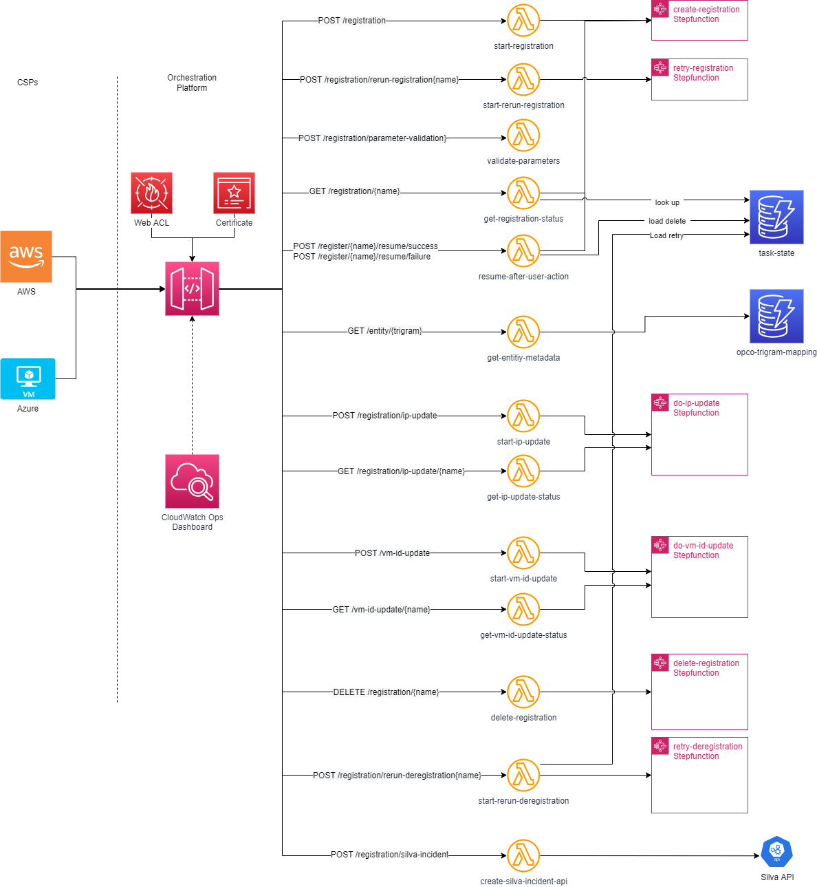
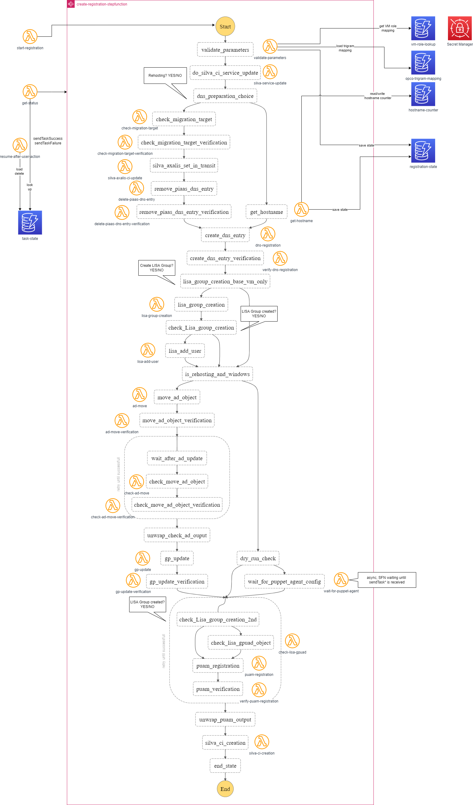
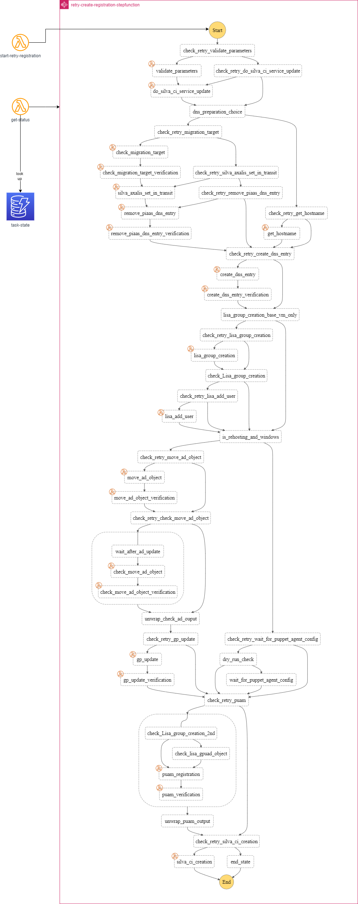
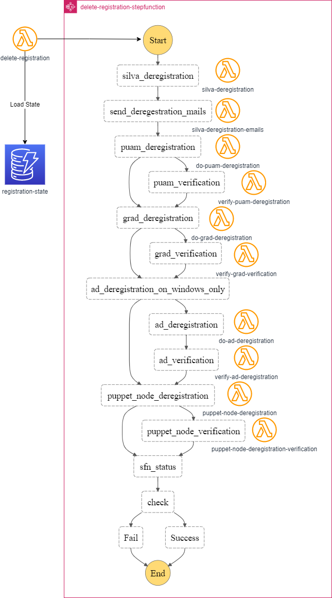
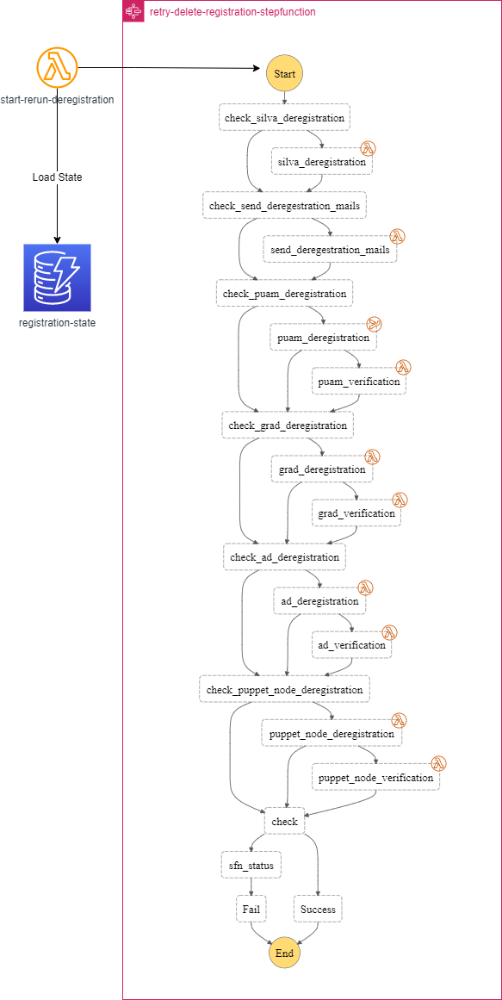

### Hi there 👋

<!--
**Bob-Monteith/Bob-Monteith** is a ✨ _special_ ✨ repository because its `README.md` (this file) appears on your GitHub profile.

Here are some ideas to get you started:

- 🔭 I’m currently working on ...
- 🌱 I’m currently learning ...
- 👯 I’m looking to collaborate on ...
- 🤔 I’m looking for help with ...
- 💬 Ask me about ...
- 📫 How to reach me: ...
- 😄 Pronouns: ...
- ⚡ Fun fact: ...
-->

## Architecture overview
Below is the Orchestration Platform technical architecture split by main features.

## API Service:

## Workflow - Create Registration:

## Workflow - Retry Registration:

## Workflow - Delete Registration:

## Workflow - Retry Delete Registration:

## Workflow - DR Failover:

## Event Management:

## How to use:
